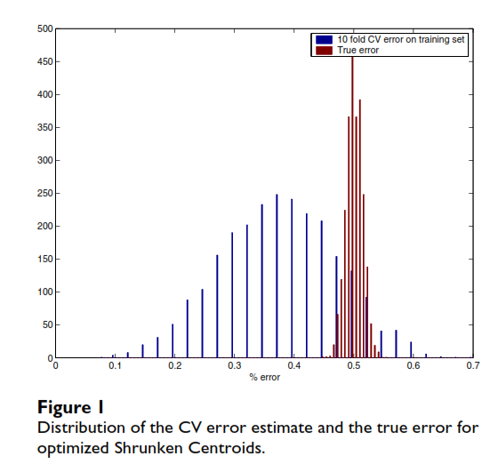
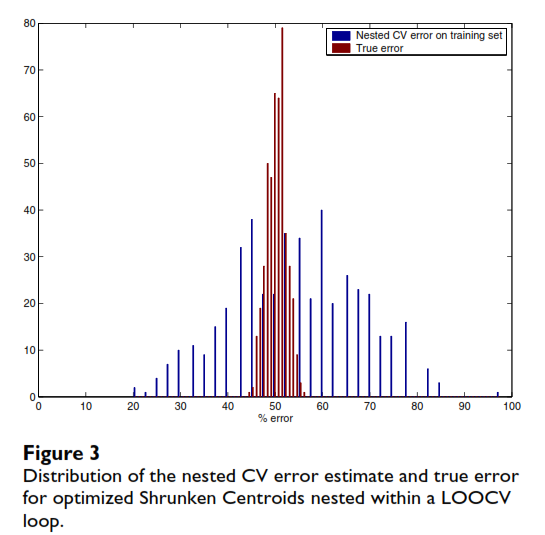

## Varma & Simon (2006)

**Title:** Bias in error estimation when using cross-validation for model selection\
**Journal:** BMC Bioinformatics

### Problem

Cross-validation (CV) can be used to estimate how well a classifier will perform on independent data. However, ordinary CV can become biased when the same CV procedure is used both to choose the best model settings and to estimate the performance of the resulting model.

### Why does the bias happen?

Choosing classifier parameters is part of the model training process. When several parameter values are tested using cross-validation, the value with the lowest CV error is selected. Because this minimum is chosen from several CV estimates, it may be too optimistic and underestimate the true prediction error. The authors call this parameter selection bias.

### What do the authors propose instead?

The classifier parameter tuning should be treated as part of the model training procedure and therefore repeated inside the cross-validation process.

They use nested cross-validation, which contains two CV loops:

-   **Inner CV:** selects the optimal classifier parameters.
-   **Outer CV:** estimates the prediction error of the tuned classifier.

This separates model tuning from model evaluation and reduces the bias in the estimated prediction error.

### Study design

A simulation study was used so they could compare the estimated prediction error with the true error.

The authors generated at least 1,000 simulated datasets each containing:

-   40 samples
-   20 samples in class 1 and 20 in class 2
-   6,000 simulated gene-expression features

They considered two types of datasets:

-   **Null datasets:** there was no true difference between the two classes, so classification should perform at about chance level.
-   **Non-null datasets:** 10 of the 6,000 features had a true difference between the classes, so there was some real predictive signal.

They then applied the classification and cross-validation procedures to these simulated datasets and compared the estimated errors with performance on independent test data.

### Classifier implementation

#### Shrunken Centroids

For the Shrunken Centroids classifier, the authors varied the tuning parameter Δ between 0.01 and 1. For each value of Δ, they calculated the 10-fold CV error and selected the value with the minimum error.

$$
\Delta^* = \arg\min_{\Delta} CV(\Delta)
$$

They then trained the optimized classifier on all 40 training samples using the selected Δ\* and tested it on 20,000 independent samples to estimate its true prediction error.

#### Support Vector Machine (SVM)

For the SVM, they tuned two parameters, C and γ. They used Leave-One-Out Cross-Validation (LOOCV) to calculate the prediction error for different combinations of these parameters and selected the combination with the minimum LOOCV error.

$$
(C^*, \gamma^*) = \arg\min_{C,\gamma} CV(C,\gamma)
$$

The optimized SVM was then trained on all 40 samples and evaluated on 20,000 independent test samples to estimate the true error.

### Nested cross-validation implementation

A nested cross-validation procedure was then evaluated in which the parameter-tuning step was repeated inside an outer CV loop.

For the Shrunken Centroids classifier, one sample was left out from the 40-sample dataset. The remaining 39 samples were used to select the optimal value of Δ using 10-fold CV. The classifier was then trained on those 39 samples using the selected Δ and used to predict the class of the one sample that had been left out.

This process was repeated until each of the 40 samples had been left out once. The average error across the 40 outer predictions was used as the nested CV error estimate.

The same nested-CV principle was also applied to the optimized SVM classifier.

In this setup the inner CV loop is used for parameter tuning and the outer CV loop is used to estimate prediction error.

### Main findings

For the null datasets, the true prediction error was approximately 50%, because there was no real difference between the two classes.

However, after tuning the classifiers, the average CV error estimates were lower than the true error:

-   Shrunken Centroids: mean CV error = 37.8%
-   SVM: mean CV error = 41.7%
-   True error for both classifiers = 50.0%

This shows that using the minimum CV error after parameter tuning made the classifiers appear more accurate than they really were on independent data.

Figure 1 shows this bias for the optimized Shrunken Centroids classifier.

{fig-alt="Figure 1 from Varma and Simon (2006)"}

*Source: Varma & Simon (2006), Figure 1.*

Nested cross-validation produced error estimates that were much closer to the true error.

For the Shrunken Centroids classifier on null data:

- Nested CV error = 54.2%
- True error = 50.0%

{fig-alt="Figure 3 from Varma and Simon (2006)"}

*Source: Varma & Simon (2006), Figure 3.*

For the SVM classifier on non-null data:

-   Nested CV error = 35.3%
-   True error = 32.0%

Their results showed that nested CV substantially reduced the bias in the estimated prediction error.

### Main conclusion: stop doing X, start doing Y

**Stop:** using the minimum cross-validation error obtained during parameter tuning as the final estimate of how well the optimized classifier will perform on independent data.

**Start:** treat parameter tuning as part of the training process and use nested cross-validation, where the inner CV loop tunes the classifier and the outer CV loop estimates prediction error.

Takeaway: Nested CV provides an almost unbiased estimate of the true error of an optimized classifier.

### Proposed computational exploration

For my computational exploration, I plan to develop a simpler simulation that demonstrates the parameter-selection bias described in the paper.

I will simulate a binary classification problem with two equally sized classes and no true difference in the predictor distributions between the classes. Therefore, the true classification error should be approximately 50%.

I will use a k-nearest neighbors (kNN) classifier and treat the number of neighbors, k, as the tuning parameter. Each simulated training dataset will contain 40 observations, with 20 observations in each class. I will compare several candidate values of k (for example, 1, 3, 5, 7, and 9). Then, I will:

1.  Generate a training dataset of 40 observations from two equally sized classes with no true difference in their predictor distributions.
2.  Use 10-fold cross-validation to compare several values of k and select the value with the lowest CV error.
3.  Record this minimum CV error.
4.  Use nested cross-validation with 10-fold CV in the inner loop to select k and LOOCV in the outer loop to estimate prediction error.
5.  Select k using 10-fold CV on the full training dataset, train the optimized classifier on all 40 observations, and evaluate it on a large independently simulated test dataset to approximate the true prediction error.
6.  Repeat the simulation 500 times and compare the distributions of the three error estimates.

The main question will be whether the minimum CV error after tuning systematically underestimates the true prediction error, and whether nested CV produces an estimate closer to the truth.

### Planned figure

I plan to create a figure comparing the prediction-error estimates obtained from:

1.  Minimum CV error after tuning
2.  Nested CV
3.  Independent test-set error

The figure will summarize the distribution of these errors across repeated simulations.

Because the simulated data will contain no true class difference, the independent test-set error should be approximately 50%. A persuasive result would show that the minimum CV error after tuning tends to underestimate this true error, while the nested-CV error remains closer to it.
