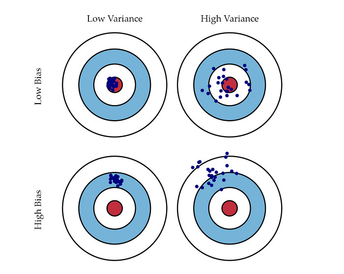
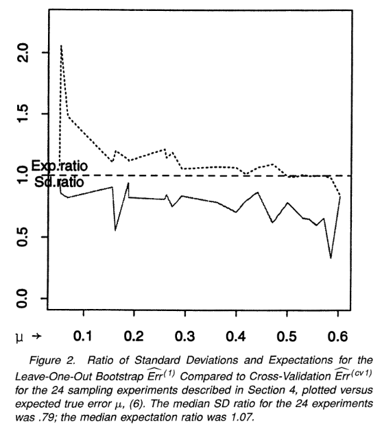
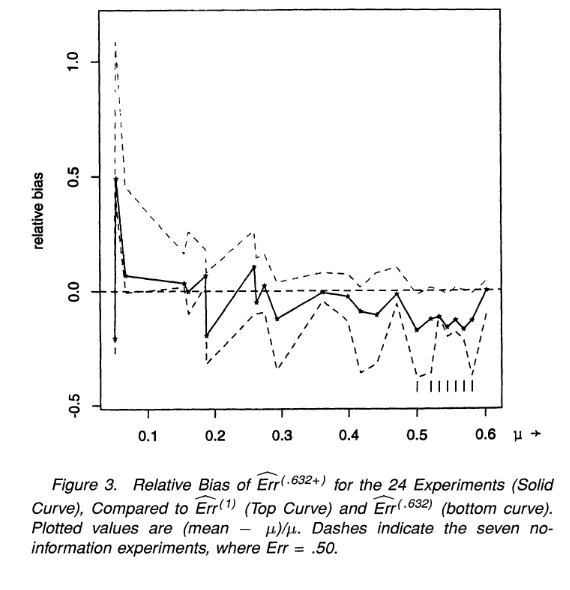
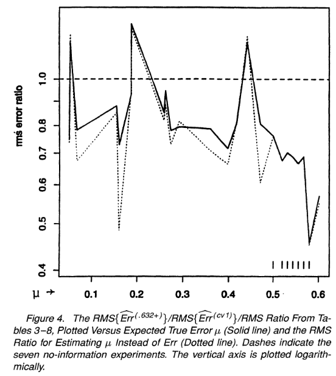

## Efron & Tibshirani (1997)

**Title:** Improvements on Cross-Validation: The .632+ Bootstrap Method\
**Journal:** Journal of the American Statistical Association (JASA)

### Problem

When a prediction model is trained on a sample of data, an important question is how accurately it will perform on new observations that were not used to train the model. Because the true prediction error on future data is usually unknown, it must be estimated from the available sample.

Cross-validation is commonly used for this purpose and can provide a nearly unbiased estimate of prediction error. However, cross-validation estimates can have high variability, meaning that the estimated error may change substantially across different samples drawn from the same population.

Bootstrap methods provide another way to estimate prediction error. By repeatedly resampling the observed data and averaging across many bootstrap samples, they can produce more stable error estimates with lower variability. However, this reduction in variability can come at the cost of increased bias.

This creates a bias–variance trade-off: an estimator with very low bias may still perform poorly if it is highly variable, while a more stable estimator may perform better overall even if it introduces some bias. Efron and Tibshirani therefore investigate whether bootstrap-based methods can achieve a better balance between bias and variability when estimating prediction error.

{fig-alt="Illustration of low and high bias combined with low and high variance"}

The center of each target represents the true value. Bias describes how far the estimates are systematically shifted away from the truth, while variance describes how widely the estimates are spread across repeated samples. Ideally, an estimator should have both low bias and low variance.

### What do the authors propose instead?

The authors investigate bootstrap-based estimates of prediction error as a way to reduce the high variability that can occur with cross-validation. Their main contribution is the **.632+ bootstrap estimator**, which attempts to combine relatively low variability with limited bias.

A bootstrap sample is created by repeatedly sampling observations from the original dataset **with replacement**. This means that after an observation is selected, it remains available to be selected again. As a result, some observations may appear several times in a bootstrap sample, while others may not appear at all.

To illustrate, consider a very small dataset containing five observations:

$$
\{1,2,3,4,5\}.
$$

Each bootstrap sample also contains five draws, but all five draws come from the original observations.

```{r, echo=FALSE}
set.seed(632) # Makes the bootstrap samples reproducible

original <- 1:5 # Original dataset

bootstrap_1 <- sample(original, size = 5, replace = TRUE)
bootstrap_2 <- sample(original, size = 5, replace = TRUE)
bootstrap_3 <- sample(original, size = 5, replace = TRUE)

bootstrap_table <- data.frame(
  Sample = c("Bootstrap 1", "Bootstrap 2", "Bootstrap 3"),
  Draw_1 = c(bootstrap_1[1], bootstrap_2[1], bootstrap_3[1]),
  Draw_2 = c(bootstrap_1[2], bootstrap_2[2], bootstrap_3[2]),
  Draw_3 = c(bootstrap_1[3], bootstrap_2[3], bootstrap_3[3]),
  Draw_4 = c(bootstrap_1[4], bootstrap_2[4], bootstrap_3[4]),
  Draw_5 = c(bootstrap_1[5], bootstrap_2[5], bootstrap_3[5]),
  Omitted = c(
    paste(setdiff(original, bootstrap_1), collapse = ", "),
    paste(setdiff(original, bootstrap_2), collapse = ", "),
    paste(setdiff(original, bootstrap_3), collapse = ", ")
  )
)

knitr::kable(
  bootstrap_table,
  align = "c",
  caption = "Example of bootstrap resampling with replacement"
)

```

Although each bootstrap sample contains the same number of draws as the original dataset, repeated observations mean that not every original observation is necessarily represented.

For a dataset containing $n$ observations, the probability that a particular observation is **not** selected in one bootstrap sample is

$$
\left(1-\frac{1}{n}\right)^n.
$$

As $n$ becomes large, this approaches

$$
e^{-1} \approx 0.368.
$$

Therefore, approximately 36.8% of the original observations are expected to be left out of a bootstrap sample, while approximately

$$
1-0.368=0.632
$$

or 63.2% are represented at least once.

The observations that are not selected in a particular bootstrap sample were not used to train the model on that resample. They can therefore be used to evaluate how well the fitted prediction rule performs on observations that were left out of training.

By repeating this process across many bootstrap samples and averaging the resulting prediction errors, the estimate becomes smoother and generally less variable than ordinary leave-one-out cross-validation.

However, bootstrap estimation introduces another problem. Although a bootstrap sample contains $n$ draws, only about 63.2% of the original observations are represented as unique observations. The fitted model is therefore effectively being trained on less unique information than the model trained on the complete dataset.

Because prediction error generally increases when a model is trained on less data, the leave-one-out bootstrap estimate can be biased upward. Thus, bootstrap smoothing reduces variability but may introduce bias.

To correct this upward bias, Efron previously proposed the **.632 estimator**, which combines the apparent training error with the leave-one-out bootstrap prediction error:

$$
\widehat{\mathrm{Err}}_{.632}
=
0.368\,\mathrm{err}
+
0.632\,\widehat{\mathrm{Err}}^{(1)}.
$$

Here:

- $\mathrm{err}$ is the **apparent error**, obtained by evaluating the fitted model on the same observations used to train it. Because the model has already seen these observations, this error is generally biased downward.
- $\widehat{\mathrm{Err}}^{(1)}$ is the **leave-one-out bootstrap error**, estimated using observations that were omitted from the bootstrap samples used to fit the model.

The .632 estimator therefore combines an error estimate that tends to be too optimistic with one that tends to be too pessimistic. It assigns 36.8% weight to the apparent training error and 63.2% weight to the bootstrap error.

However, the .632 estimator can become too optimistic when the prediction rule strongly overfits the training data.

The authors illustrate this using a no-information classification problem in which the outcome is equally likely to belong to either of two classes and the predictors contain no useful information about the outcome. In this setting, the true prediction error is 50%.

A highly flexible classifier such as 1-nearest-neighbor can nevertheless achieve an apparent training error of

$$
\mathrm{err}=0,
$$

because each training observation is effectively able to predict itself.

If the leave-one-out bootstrap error is approximately equal to the true no-information error of 0.50, the original .632 estimator would give

$$
\widehat{\mathrm{Err}}_{.632}
=
0.368(0)
+
0.632(0.50)
=
0.316.
$$

The estimated prediction error would therefore be only 31.6%, even though the true error is 50%. The problem occurs because the .632 estimator always assigns 36.8% of its weight to the apparent training error, even when that training error is extremely optimistic because of overfitting.

To address this problem, Efron and Tibshirani propose the **.632+ estimator**. Unlike the original .632 estimator, which always uses a fixed bootstrap weight of 0.632, the .632+ method changes the weight according to how strongly the fitted prediction rule appears to be overfitting.

To quantify the amount of overfitting, the authors define a **relative overfitting rate**, $R$:

$$
R
=
\frac{
\widehat{\mathrm{Err}}^{(1)}-\mathrm{err}
}{
\gamma-\mathrm{err}
}.
$$

Here, $\gamma$ represents the **no-information error rate**, or the prediction error expected when the predictors contain no useful information about the outcome.

The numerator,

$$
\widehat{\mathrm{Err}}^{(1)}-\mathrm{err},
$$

measures how much worse the model performs on observations that were not used for training compared with its apparent training performance. The denominator scales this difference relative to the error expected when there is no useful predictive information.

Conceptually:

- $R \approx 0$ indicates little evidence of overfitting.
- $R \approx 1$ indicates severe overfitting.

The .632+ estimator then uses $R$ to determine the weight placed on the bootstrap error:

$$
w
=
\frac{0.632}
{1-0.368R}.
$$

The final prediction-error estimate is

$$
\widehat{\mathrm{Err}}_{.632+}
=
(1-w)\mathrm{err}
+
w\widehat{\mathrm{Err}}^{(1)}.
$$

When there is little overfitting and $R$ is close to 0, $w$ is approximately 0.632, so the method behaves similarly to the original .632 estimator.

As overfitting becomes more severe and $R$ approaches 1, $w$ approaches 1. The estimator therefore gives progressively less weight to the overly optimistic training error and more weight to the bootstrap prediction error.

The .632+ method therefore attempts to preserve the lower variability obtained through bootstrap smoothing while reducing the optimistic bias that can occur when a prediction rule strongly overfits the training data.

### Study design

The authors evaluated the performance of the .632+ estimator using a series of **24 sampling experiments** designed to represent different prediction problems.

The experiments varied several characteristics of the prediction problem, including:

- training sample size
- number of predictors
- number of outcome classes
- strength of the relationship between the predictors and outcome
- type of prediction rule

Twenty-one of the experiments involved binary classification, while three involved four or more classes. Classification performance was evaluated using **0-1 loss**, where each prediction was recorded as either correct or incorrect.

Most of the experiments used simulated data, which allowed the authors to know the underlying data-generating distribution and therefore determine the true prediction error against which the different error estimators could be compared.

The first 12 experiments were each repeated using **200 independently generated training datasets**, while the remaining 12 experiments used **50 repetitions**. This repeated-sampling design allowed the authors to examine not only the average bias of each error estimator, but also how much the estimates varied across different training samples.

The experiments included both settings with useful predictive information and **no-information settings**, in which the predictors were independent of the outcome. In the binary no-information experiments, the true prediction error was approximately 50%.

The final experiments also included real classification datasets from the UC Irvine Machine Learning Repository, allowing the methods to be evaluated beyond completely simulated examples.

For each experiment, the authors compared several methods for estimating prediction error, including leave-one-out cross-validation, 5-fold and 10-fold cross-validation, the leave-one-out bootstrap estimator, the original .632 estimator, and the new .632+ estimator.

The bootstrap-based methods used **50 bootstrap replications** for each simulated training dataset.

The performance of each error estimator was summarized using three quantities:

- **Expectation (Exp):** the average estimated prediction error across repeated samples, which can be compared with the true error to assess bias.
- **Standard deviation (SD):** how much the estimated prediction error varied across repeated samples.
- **Root mean squared error (RMS):** the overall discrepancy between the estimated and true prediction error, reflecting both bias and variability.

### Classifier implementation

The authors evaluated the different prediction-error estimators using several classification rules with different levels of flexibility and stability. This was important because the performance of cross-validation and bootstrap error estimates can depend on the type of prediction rule being evaluated.

The classifiers included:

- Fisher's linear discriminant function (LDF)
- 1-nearest neighbor (1-NN)
- 3-nearest neighbor (3-NN)
- classification trees
- quadratic discriminant function (QDF)

Using several different classifiers allowed the authors to examine whether the .632+ estimator performed well across both relatively smooth prediction rules and more flexible or unstable rules.

#### Linear discriminant function (LDF)

The **linear discriminant function (LDF)** is equivalent to Fisher's linear discriminant analysis. It classifies an observation by comparing how likely its predictor values are to belong to each possible class.

For interpretation, suppose that the predictor vector for an observation is

$$
\mathbf{x}=(x_1,x_2,\ldots,x_p).
$$

Linear discriminant analysis assumes that the predictors within each class approximately follow a multivariate normal distribution,

$$
\mathbf{X}\mid Y=k
\sim
N_p(\boldsymbol{\mu}_k,\Sigma),
$$

where $\boldsymbol{\mu}_k$ represents the mean predictor vector for class $k$ and $\Sigma$ is a covariance matrix shared across the classes.

For each class, a discriminant score can be calculated as

$$
\delta_k(\mathbf{x})
=
\mathbf{x}^T\Sigma^{-1}\boldsymbol{\mu}_k
-
\frac{1}{2}
\boldsymbol{\mu}_k^T\Sigma^{-1}\boldsymbol{\mu}_k
+
\log(\pi_k),
$$

where $\pi_k$ represents the prior probability of belonging to class $k$.

The observation is assigned to the class with the largest discriminant score:

$$
\widehat{Y}
=
\underset{k}{\arg\max}\,
\delta_k(\mathbf{x}).
$$

Because all classes are assumed to share the same covariance matrix, the resulting decision boundary is linear. LDF therefore represents a relatively smooth prediction rule compared with methods such as nearest-neighbor classification.

#### 1-nearest neighbor

The **1-nearest-neighbor (1-NN)** classifier makes predictions using the observation in the training dataset that is closest to the new observation.

The distance between two observations can be measured using Euclidean distance:

$$
d(\mathbf{x}_i,\mathbf{x}_j)
=
\sqrt{
\sum_{m=1}^{p}
(x_{im}-x_{jm})^2
}.
$$

For a new observation $\mathbf{x}_0$, the classifier identifies the training observation with the smallest distance:

$$
j^*
=
\underset{j}{\arg\min}\,
d(\mathbf{x}_0,\mathbf{x}_j),
$$

and assigns the new observation the same class as that nearest neighbor:

$$
\widehat{Y}_0=Y_{j^*}.
$$

Unlike LDF, 1-NN can create highly irregular decision boundaries because its prediction can change whenever the identity of the nearest observation changes.

This flexibility is particularly important in the context of the .632+ paper. When 1-NN is evaluated on the same observations used for training, each observation is its own nearest neighbor. The apparent training error can therefore be approximately zero even when the predictors contain no real information about the outcome.

This makes 1-NN an important example of a prediction rule that can appear to perform extremely well on its training data while performing much worse on new observations.

#### 3-nearest neighbor

The **3-nearest-neighbor (3-NN)** classifier follows the same general principle as 1-NN but uses the three closest training observations rather than only one.

For a new observation, the three training observations with the smallest distances are identified. The predicted class is then determined by majority vote among those three neighbors.

For example, if the three nearest observations belong to

$$
\{A,A,B\},
$$

the new observation is classified as class $A$.

Because the prediction depends on several nearby observations instead of only one, 3-NN is generally smoother than 1-NN. However, it remains a local and relatively flexible prediction rule.

Including both 1-NN and 3-NN allowed the authors to examine how the error estimators behaved when the flexibility of the nearest-neighbor prediction rule changed.

#### Classification trees

The authors also evaluated a **classification tree**.

A classification tree repeatedly divides the predictor space into smaller regions using decision rules based on individual predictors. A simple split might take the form

$$
x_j < c,
$$

where $x_j$ is one predictor and $c$ is a selected cutoff value.

Observations satisfying the condition are sent to one branch of the tree, while the remaining observations are sent to another. The procedure continues recursively, producing a collection of terminal regions or leaves.

A new observation follows these decision rules through the tree until it reaches a terminal node, where it is assigned the class associated with that node.

Because relatively small changes in the training data can sometimes produce different splits and therefore a different tree, classification trees can represent relatively unstable prediction rules. This makes them useful for studying whether bootstrap smoothing can reduce variability in estimated prediction error.

#### Quadratic discriminant function (QDF)

The **quadratic discriminant function (QDF)** is related to LDF but allows each class to have its own covariance matrix.

Instead of assuming

$$
\mathbf{X}\mid Y=k
\sim
N_p(\boldsymbol{\mu}_k,\Sigma),
$$

QDF allows

$$
\mathbf{X}\mid Y=k
\sim
N_p(\boldsymbol{\mu}_k,\Sigma_k).
$$

A standard quadratic discriminant score can be written as

$$
\delta_k(\mathbf{x})
=
-\frac{1}{2}\log|\Sigma_k|
-\frac{1}{2}
(\mathbf{x}-\boldsymbol{\mu}_k)^T
\Sigma_k^{-1}
(\mathbf{x}-\boldsymbol{\mu}_k)
+
\log(\pi_k).
$$

The predicted class is again the class with the largest discriminant score:

$$
\widehat{Y}
=
\underset{k}{\arg\max}\,
\delta_k(\mathbf{x}).
$$

Because the covariance matrix can differ between classes, the resulting decision boundaries can be curved rather than linear. QDF is therefore more flexible than LDF but also requires estimating more parameters from the training data.

#### Why use several different classifiers?

The classifiers used in the experiments represent prediction rules with different levels of smoothness and flexibility.

| Prediction rule | General behavior |
|---|---|
| LDF | Relatively smooth, linear decision boundary |
| 1-NN | Highly local and flexible |
| 3-NN | Local but smoother than 1-NN |
| Classification tree | Flexible and potentially unstable |
| QDF | More flexible discriminant rule with quadratic boundaries |

This diversity was important because the authors were not only interested in whether .632+ worked for one particular classifier. They wanted to determine whether its bias and variability advantages remained useful across prediction problems with substantially different types of prediction rules.

### Bootstrap implementation

For each training dataset, the authors generated multiple bootstrap samples and used them to estimate prediction error. In the simulation experiments, each bootstrap-based estimate used

$$
B = 50
$$

bootstrap replications.

Each bootstrap sample contained $n$ draws with replacement from the original training dataset of $n$ observations. The prediction rule was fitted separately to each bootstrap sample.

The important feature of the procedure is that an observation was evaluated only using bootstrap samples in which that observation had **not** been selected.

Suppose the original training dataset is

$$
\mathcal{D}
=
\{(\mathbf{x}_i,y_i)\}_{i=1}^{n},
$$

and let

$$
\mathcal{D}^{*b}
$$

represent bootstrap sample $b$, where

$$
b=1,\ldots,B.
$$

For each original observation $i$, define an indicator

$$
I_i^b
=
\begin{cases}
1, & \text{if observation } i \text{ is absent from bootstrap sample } b,\\
0, & \text{if observation } i \text{ is included in bootstrap sample } b.
\end{cases}
$$

The model fitted using bootstrap sample $b$ is then used to predict observation $i$ only when $I_i^b=1$.

For classification with 0-1 loss, the prediction error for observation $i$ from bootstrap sample $b$ can be written as

$$
Q_i^b
=
I(\widehat{Y}_i^b \neq Y_i),
$$

where $Q_i^b=1$ when the observation is classified incorrectly and $Q_i^b=0$ when it is classified correctly.

For each original observation, the errors from all bootstrap samples in which that observation was omitted are averaged:

$$
\widehat{e}_i
=
\frac{
\sum_{b=1}^{B} I_i^b Q_i^b
}{
\sum_{b=1}^{B} I_i^b
}.
$$

The **leave-one-out bootstrap error** is then obtained by averaging these errors across all $n$ original observations:

$$
\widehat{\mathrm{Err}}^{(1)}
=
\frac{1}{n}
\sum_{i=1}^{n}
\widehat{e}_i.
$$

This procedure is conceptually similar to cross-validation because an observation is evaluated only by models that were trained without that observation. The difference is that bootstrap estimation averages predictions across many resampled training datasets rather than using a single predefined set of cross-validation folds.

The complete bootstrap procedure can therefore be summarized as:

1. Draw a bootstrap sample of size $n$ from the original training dataset with replacement.
2. Fit the prediction rule using that bootstrap sample.
3. Identify the original observations that were not selected in the bootstrap sample.
4. Use the fitted model to predict those omitted observations.
5. Record whether each prediction is correct or incorrect.
6. Repeat the process for $B=50$ bootstrap samples.
7. For each original observation, average its prediction errors across the bootstrap samples in which it was omitted.
8. Average these observation-level errors to obtain $\widehat{\mathrm{Err}}^{(1)}$.

```{mermaid}
flowchart TD
    A["Original training dataset of n observations"] --> B["Draw bootstrap sample of size n with replacement"]
    B --> C["Fit prediction rule to bootstrap sample"]
    C --> D["Identify observations omitted from this bootstrap sample"]
    D --> E["Predict the omitted observations"]
    E --> F["Record 0-1 prediction errors"]
    F --> G["Repeat for B = 50 bootstrap samples"]
    G --> H["Average errors for each observation across samples where it was omitted"]
    H --> I["Average across all observations"]
    I --> J["Leave-one-out bootstrap error"]
```

Once $\widehat{\mathrm{Err}}^{(1)}$ has been calculated, it can be combined with the apparent training error to obtain the original .632 estimate:

$$
\widehat{\mathrm{Err}}_{.632}
=
0.368\,\mathrm{err}
+
0.632\,\widehat{\mathrm{Err}}^{(1)}.
$$

For the .632+ estimator, the authors additionally calculate the relative overfitting rate $R$ and use it to determine the adaptive bootstrap weight

$$
w
=
\frac{0.632}{1-0.368R}.
$$

The final .632+ estimate is then

$$
\widehat{\mathrm{Err}}_{.632+}
=
(1-w)\mathrm{err}
+
w\widehat{\mathrm{Err}}^{(1)}.
$$

Thus, the same set of bootstrap replications first provides the leave-one-out bootstrap error, which is then used to calculate the .632 and .632+ prediction-error estimates.

### Main findings

The results showed that no single method was best in every respect. Cross-validation tended to have relatively low bias, while bootstrap-based methods generally produced less variable estimates of prediction error.

#### Bootstrap smoothing reduced variability

The first important finding was that the leave-one-out bootstrap estimate, $\widehat{\mathrm{Err}}^{(1)}$, was consistently less variable than leave-one-out cross-validation.

Across the 24 experiments, the median ratio of the standard deviation of the bootstrap estimate to the standard deviation of the cross-validation estimate was

$$
\frac{
SD\left(\widehat{\mathrm{Err}}^{(1)}\right)
}{
SD\left(\widehat{\mathrm{Err}}_{\mathrm{CV}}\right)
}
=
0.79.
$$

This means that the bootstrap error estimate typically had substantially lower variability than leave-one-out cross-validation.

The authors noted that this reduction in variability was roughly equivalent to increasing the training sample size by about 60%.

{fig-alt="Comparison of the variability and expectation of leave-one-out bootstrap and cross-validation across the 24 experiments"}

*Source: Efron & Tibshirani (1997), Figure 2.*

However, the bootstrap estimate was not unbiased. The average bootstrap error tended to be slightly higher than the cross-validation error, illustrating the trade-off between reduced variability and increased bias.

#### The original .632 estimator could be too optimistic

The original .632 estimator reduced the upward bias of the leave-one-out bootstrap estimate by combining it with the apparent training error.

However, in prediction rules that strongly overfit the training data, particularly nearest-neighbor classifiers, the .632 estimator could become substantially biased downward.

This occurred because the apparent training error could be extremely small even when prediction performance on new data was poor. The fixed 36.8% weight placed on this optimistic training error could therefore pull the .632 estimate too far downward.

The .632+ estimator was designed to reduce this problem by increasing the weight placed on the bootstrap error when evidence of overfitting was strong.

#### .632+ improved the bias–variance compromise

Across the simulation experiments, the .632+ estimator generally provided a compromise between the upward bias of the leave-one-out bootstrap estimator and the downward bias that could occur with the original .632 estimator.

{fig-alt="Relative bias of the leave-one-out bootstrap, .632 estimator, and .632+ estimator across the simulation experiments"}

*Source: Efron & Tibshirani (1997), Figure 3.*

The purpose of the adaptive weighting in .632+ was therefore not to eliminate bias completely, but to prevent the strong optimistic bias that could occur with .632 while retaining much of the reduction in variability obtained through bootstrap smoothing.

#### .632+ had the lowest overall estimation error

Because an estimator can have low bias but still perform poorly if it is highly variable, the authors also compared the methods using root mean squared error (RMS).

Across the 24 experiments, the .632+ estimator was the best overall performer in terms of RMS error.

The authors compared the RMS error of .632+ with that of leave-one-out cross-validation using

$$
\frac{
RMS\left(\widehat{\mathrm{Err}}_{.632+}\right)
}{
RMS\left(\widehat{\mathrm{Err}}_{\mathrm{CV}}\right)
}.
$$

The median value of this ratio across the 24 experiments was

$$
0.78.
$$

A value below 1 indicates that .632+ had lower RMS error than leave-one-out cross-validation. A median ratio of 0.78 therefore indicates that the overall estimation error of .632+ was substantially smaller across the experiments.

{fig-alt="Ratio of RMS error for the .632+ estimator compared with leave-one-out cross-validation across the 24 experiments"}

*Source: Efron & Tibshirani (1997), Figure 4.*

Overall, the results suggest that the main advantage of .632+ was not that it was completely unbiased. Instead, it achieved a better balance between bias and variability, resulting in lower overall prediction-error estimation error across a wide range of classification problems.

### Main conclusion: stop doing X, start doing Y

**Stop:** relying only on leave-one-out cross-validation when estimating prediction error, especially when the resulting estimate may be highly variable, and avoid using the original .632 estimator without accounting for strong overfitting.

**Start:** use the .632+ bootstrap estimator when a lower-variance estimate of prediction error is desired, particularly in settings where the fitted prediction rule may overfit the training data.

Takeaway: The .632+ estimator improves the overall estimation of prediction error by adaptively balancing the optimistic apparent training error with the bootstrap error, producing a better bias–variance trade-off than ordinary cross-validation in the authors' experiments.

### Proposed computational exploration


